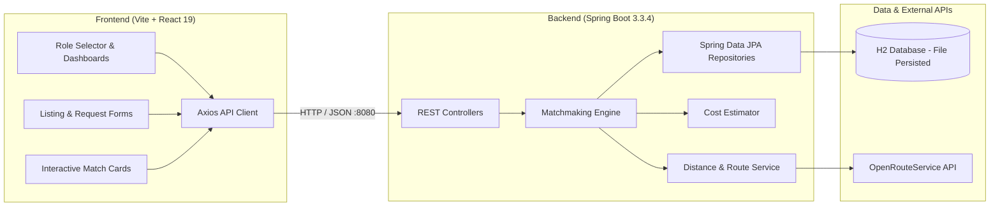

# 🌍 CarbonLink: Carbon Capture-to-Product Matchmaking Platform

> **HackOut '26 Submission** | **Theme:** Circular Carbon Ecosystem  
> **Team:** Code Innovators  
> **Problem Statement:** Carbon Capture-to-Product Matchmaking Platform (Page 10)

---

## 📌 Executive Summary

Heavy industries that capture $\text{CO}_2$ (such as cement, steel, thermal power, and chemical plants) often view captured carbon as an expensive liability or waste stream. Meanwhile, emerging carbon-utilization startups (producing e-fuels, carbon-cured concrete, biochar, algae farming, and commercial greenhouses) struggle to discover reliable, high-purity, geographically viable $\text{CO}_2$ sources.

**CarbonLink** solves this two-sided discovery problem with an intelligent B2B marketplace:
1. **Supply Listing**: Emitters list captured $\text{CO}_2$ streams (volume in metric tons, purity %, capture technology, price per ton, and facility coordinates).
2. **Demand Requests**: Buyers specify their required volume, minimum purity threshold, maximum budget, and geographic constraint.
3. **Smart Matchmaking Engine**: Computes multi-factor match scores based on purity compatibility, supply-demand volume alignment, budget tolerance, and transit distance.
4. **Logistics & Route Cost Estimator**: Calculates road transit distances (via OpenRouteService API with automatic Haversine fallback) and delivers freight cost estimates ($\$/\text{ton}$).
5. **Lifecycle Deal Workflow**: Buyers and emitters can request matches, accept contracts, or reject proposals with live status tracking.

---

## 🏗 System Architecture & Tech Stack



### Technology Stack
* **Frontend**: React 19, Vite, Tailwind CSS, Axios, Lucide Icons
* **Backend**: Java 17+, Spring Boot 3.3.4 (Spring Web, Spring Data JPA, Hibernate, Validation, Lombok)
* **Database**: H2 Database (`./data/carbonlink` file-persisted)
* **Routing/GIS**: OpenRouteService Driving Distance API (with Haversine geometric fallback)

---

## 🚀 Getting Started Locally

### Prerequisites
Make sure your system has the following installed:
* **Java**: JDK 17 or 21 (`java -version`)
* **Node.js**: Node 18+ and npm (`node -v`, `npm -v`)
* **Maven** (or an IDE like IntelliJ IDEA / VS Code / Antigravity IDE with Java extensions)
* **Git**

---

### Step 1: Run the Backend (Spring Boot)

#### Option A: Running from Terminal (with Maven)
Open a terminal in the root directory:
```bash
cd backend

# Run with demo seed data pre-populated (Recommended for Hackathon demos)
mvn spring-boot:run -Dspring-boot.run.profiles=demo

# Or run in standard mode without pre-seeded data
mvn spring-boot:run
```

#### Option B: Running from your IDE (Antigravity IDE / VS Code / IntelliJ)
1. Open the project in your IDE.
2. Navigate to: `backend/src/main/java/com/carbonlink/CarbonLinkApplication.java`.
3. Click the **Run** or **Debug** button above the `main` method.
4. *(Optional Demo Seed)*: Add VM option `--spring.profiles.active=demo` in your run configuration to preload mock emitters, buyers, listings, and requests.

> **Backend Service:** Running at `http://localhost:8080`  
> **H2 Console:** Accessible at `http://localhost:8080/h2-console`  
> - JDBC URL: `jdbc:h2:file:./data/carbonlink;AUTO_SERVER=TRUE`  
> - Username: `sa` | Password: *(blank)*

---

### Step 2: Run the Frontend (React + Vite)

Open a second terminal window:
```bash
cd frontend

# 1. Install dependencies (if not already done)
npm install

# 2. Start the Vite development server
npm run dev
```

> **Frontend Application:** Open `http://localhost:5173` in your browser.

---

## 🧪 Testing & Verification

### Test Backend
Inside `backend/`:
```bash
mvn test
```
All unit and integration tests (MatchServiceTest, MatchingServiceTest, DistanceServiceTest, CostEstimatorServiceTest) run automatically.

### Test Frontend Build & Lint
Inside `frontend/`:
```bash
# Verify production build bundle
npm run build

# Run fast linter
npm run lint
```

---

## 📡 Key REST API Endpoints

| Method | Endpoint | Description |
|---|---|---|
| `GET` | `/api/cities` | List supported industrial hub cities and coordinates |
| `GET` | `/api/users` | List registered emitters or buyers (`?role=EMITTER` or `BUYER`) |
| `POST` | `/api/users` | Register a new emitter or buyer profile |
| `GET` | `/api/listings` | Fetch available carbon listings with optional filters |
| `POST` | `/api/listings` | Post a new $\text{CO}_2$ capture batch |
| `GET` | `/api/listings/{id}/matches` | Get scored buyer matches for an emitter listing |
| `GET` | `/api/requests` | Fetch buyer carbon demand requests |
| `POST` | `/api/requests` | Post a new carbon demand request |
| `GET` | `/api/requests/{id}/matches` | Get scored emitter matches for a buyer request |
| `POST` | `/api/matches/{id}/request` | Request a transaction match (Buyer/Emitter) |
| `POST` | `/api/matches/{id}/accept` | Accept an active match proposal |
| `POST` | `/api/matches/{id}/reject` | Reject a match proposal |

---

## 👥 Git Collaboration & Team Workflow

### Push Local Setup to Main
```bash
# From the root directory:
git add .
git commit -m "feat: complete CarbonLink frontend and backend initial baseline"
git push origin main
```

### Working on Feature Branches
To keep work organized between frontend and backend teammates:

#### Frontend Developers:
```bash
git checkout features_frontend
git pull origin features_frontend
# ... make frontend changes in frontend/ ...
git add frontend/
git commit -m "feat(frontend): refine match card visual indicators"
git push origin features_frontend
```

#### Backend Developers:
```bash
git checkout features_backend
git pull origin features_backend
# ... make backend changes in backend/ ...
git add backend/
git commit -m "feat(backend): add custom carbon certification generation"
git push origin features_backend
```
